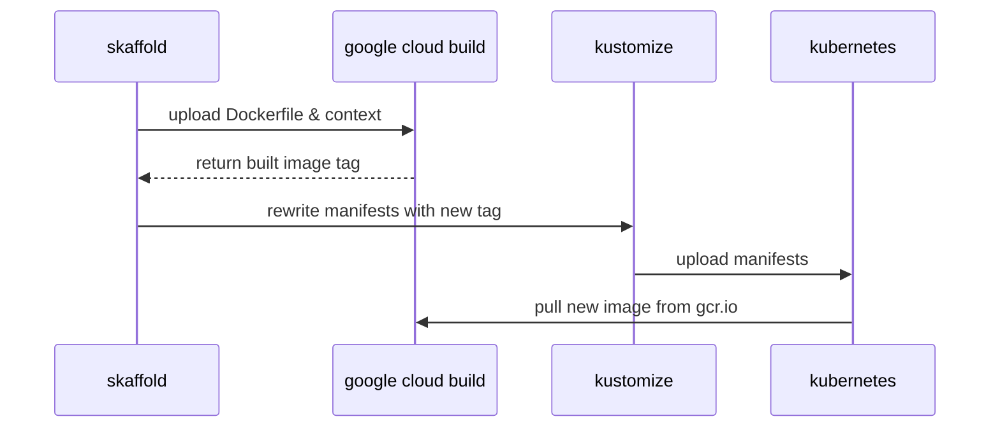

# Running Camunda BPM on Kubernetes

Are you running Kubernetes now? Ready to move your Camunda BPM instances off of VMs, or just try it out on Kubernetes? We will address some common configurations and provide some building blocks you can tailor to your particular needs.

# TODOS

- Update documentation to point to github
- Send to josh for review
- Rewrite repo links
- Rewrite image name
	- Need to scrub camunda-cloud-240911 from files
	- Publish docker image and edit location to latest


## Authors

- [Alastair Firth](https://github.com/afirth) is a Senior Site Reliability Engineer on the Camunda Cloud team.
- [Lars Lange](https://github.com/Langleu) is a Devops Engineer at Camunda.

## TL:DR;

```
go get sigs.k8s.io/kustomize
git clone https://github.com/afirth/camunda-examples.git
cd camunda-examples/camunda-bpm-demo
make
```

# What is Camunda BPM

[Camunda BPM](https://camunda.com) is an [open source](https://github.com/camunda/camunda-bpm-platform) platform for workflow and decision automation that brings business users and software developers together. It is ideal for coordinating and connecting humans, (micro)services, or even robots! You can read more about some use cases [here](https://camunda.com/solutions/).

# Why run on Kubernetes

Kubernetes has become the de facto standard for running modern applications on Linux. By using system calls instead of emulating the hardware layer, and allowing the kernel to manage memory and task switching, overhead and startup times are minimized. However, the greatest benefit may come in the standard API it provides for configuring the infrastructure all applications need, such as storage, networking, and monitoring. 5 years old in June 2019, it's arguably the second largest open source project ever (behind Linux), and is stabilizing in feature set after the rapid iteration of the past few years as it becomes critical to production workloads around the globe.

Camunda BPM Engine can easily connect easily to other applications running in the same cluster, and Kubernetes provides great scalability, allowing you to grow your infrastructure costs only when the software really needs it (and shrink it moments later).

Visibility is also greatly improved by tools like Prometheus, Grafana, Loki, Fluentd and Elasticsearch allowing a centralized view of all cluster workloads. We'll look at how to inject a Prometheus exporter into the JVM today.

# Goals

We'll address several areas where we can configure the Camunda BPM docker image ([github](https://github.com/camunda/docker-camunda-bpm-platform)) to play nicely with Kubernetes.

1. Logs and metrics
2. Database connections
3. Authentication
4. Session Management

We will go through some techniques to address these, and show a workflow that might work for you.

## Workflows

Three workflows are available
1. Kustomize + Kubectl
2. Skaffold + Kustomize + Kubectl + optionally Google cloud build
3. Kubectl only

See the Prerequisites for information on installing these packages

> **Note:** Using Enterprise? See [here](https://docs.camunda.org/manual/7.11/installation/docker/) and update the image references accordingly.

### Manifests Only Workflow

(requires kubectl)
If you don't want to use kustomize or skaffold, you can refer to the manifests in `generated-manifest.yaml`, and adapt them to the workflow of your choice.

### Basic Workflow

(requires Kustomize>7a1a231 & kubectl)
Kustomize handles overlaying the yaml files (providing similar flexibility as helm), but allowing you to extend arbitrarily rather than relying on the chart maintainer adding your particular change to the go template, or requiring you to keep a fork. Since 1.14, it's available in kubectl, but you should install it from HEAD for the time being. Kustomize generates manifests for kubectl, which we pipe through: `kustomize build | kubectl apply --dry-run -o yaml -f -` will show you whats going on (aka `make dry-run`). This doesn't build the docker image. This is the default behaviour of `make`.

> **Note:** Kustomize variable handling is still relatively new. Although kustomize is now included in kubectl as `kubectl apply -k`, as of 1.14.2 you still need to `go get sigs.k8s.io/kustomize` for the `$HOSTNAME` to work. If that's not an option, you can hardcode the variable references in `ingress-patch.yaml`

### Development Workflow



(requires Kustomize>7a1a231, kubectl, and Skaffold)
If your workflow is currently painful, you might want to try skaffold. It has good support for a variety of templating tools (like Kustomize and Helm), CI and build tools, and infrastructure providers. The `skaffold.yaml` included is configured for google cloud build and GKE, which provides a very easy way to get going on production grade infrastructure. You'll need to change the image name to your GCP project-id if you want to use it. Then `skaffold run` aka `make skaffold` will upload the Dockerfile context to cloudbuild, build the image and save it to GCR, then apply the manifests to your cluster. You still need kustomize from HEAD. This is the behaviour of `make skaffold`, but Skaffold has many other capabilities.

## Prerequisites

- A working [Kubernetes](https://kubernetes.io/) cluster
  - [GKE](https://cloud.google.com/free/) or minikube are a good way to get started
- [Optional] [Kustomize > 7a1a231](https://github.com/kubernetes-sigs/kustomize) for managing yaml overlays without forking the whole manifest, allowing you to `git pull --rebase` future improvements
  - Variable support in the ingress was added after 2.0.3 was released, so for now make sure that [go installed binaries are available on your PATH](https://gist.github.com/afirth/fabc04406eb584601b473f599eb0170a) and `go get sigs.k8s.io/kustomize`
- [Optional] [Skaffold](https://skaffold.dev/) for building your own docker images and deploying easily to GKE
  - download the latest release
    - `curl -Lo skaffold https://storage.googleapis.com/skaffold/releases/latest/skaffold-linux-amd64
 && chmod +x skaffold && sudo mv skaffold /usr/local/bin`
  - if you're using [google cloud build](https://console.cloud.google.com/cloud-build/), then
    - `gcloud auth application-default login`
  - otherwise configure `skaffold.yaml` for your providers

## Logs and Metrics

Prometheus has become the standard for capturing metrics in Kubernetes. It fills the same niche as AWS Cloudwatch Metrics, Cloudwatch Alerts, Stackdriver Metrics, StatsD, Datadog, Nagios, vSphere Metrics and others. It's open source and has a powerful query language. The front end of choice is Grafana, and it comes with lots of dashboards available out of the box. They are bundled together and relatively easy to install with the [prometheus-operator helm chart](https://github.com/helm/charts/tree/master/stable/prometheus-operator).

Prometheus defaults to a pull model scraping `<service>/metrics`, and adding a sidecar container to expose this is common. Unfortunately the JMX metrics are best captured from inside the JVM, so a sidecar isn't as effective. Let's plug the [open source jmx_exporter](https://github.com/prometheus/jmx_exporter) from Prometheus into the JVM by adding it to the container image, which will expose a `/metrics` path on another port.

### Add the Prometheus jmx_exporter to the container
```
-- images/camunda-bpm/Dockerfile
FROM camunda/camunda-bpm-platform:tomcat-7.11.0

## Add prometheus exporter
RUN wget https://repo1.maven.org/maven2/io/prometheus/jmx/jmx_prometheus_javaagent/0.11.0/jmx_prometheus_javaagent-0.11.0.jar -P lib/
#9404 is the reserved prometheus-jmx port
ENV CATALINA_OPTS -javaagent:lib/jmx_prometheus_javaagent-0.11.0.jar=9404:/etc/config/prometheus-jmx.yaml
```
Well that was easy. The exporter will monitor tomcat and expose it's metrics in Prometheus format at `<svc>:9404/metrics`

#### Configure the exporter

The sharp-eyed reader may wonder where `prometheus-jmx.yaml` is coming from. There are many different things that can run in a JVM, and tomcat is just one of them, so the exporter needs some configuration. Standard configurations for tomcat, wildfly, kafka, etc are available [here](https://github.com/prometheus/jmx_exporter/tree/master/example_configs). We'll add the tomcat one as a [ConfigMap](https://kubernetes.io/docs/tasks/configure-pod-container/configure-pod-configmap/) in Kubernetes, and then mount it as a volume.

First, we add the tomcat-flavored exporter config file to our `platform/config/` directory:

```
platform/config
└── prometheus-jmx.yaml
```
Then we add a [ConfigMapGenerator]([https://github.com/kubernetes-sigs/kustomize/blob/master/examples/configGeneration.md](https://github.com/kubernetes-sigs/kustomize/blob/master/examples/configGeneration.md)) to `kustomization.yaml`:
```
-- platform/kustomization.yaml
apiVersion: kustomize.config.k8s.io/v1beta1
kind: Kustomization
[...]
configMapGenerator:
  - name: config
    files:
      - config/prometheus-jmx.yaml
```
This will add each element of `files[]` as an element of the `config` ConfigMap. ConfigMapGenerators are great because they hash the data in the config and trigger a pod restart if it changes. They also reduce the amount of configuration in the Deployment, as you can mount the whole "folder" of config files in one VolumeMount.

Finally we need to mount the ConfigMap as a volume to the pod:
```
-- platform/deployment.yaml
apiVersion: apps/v1
kind: Deployment
[...]
spec:
  template:
    spec:
    [...]
      volumes:
        - name: config
          configMap:
            name: config
            defaultMode: 0744
      containers:
        - name: camunda-bpm
          volumeMounts:
            - mountPath: /etc/config/
              name: config
    [...]
```
Nice. If your Prometheus isn't configured to scrape everything, you may need to tell it to scrape the pods. Prometheus-operator users can use `service-monitor.yaml` to get started. See `service-monitor.yaml`, [operator design](https://github.com/coreos/prometheus-operator/blob/master/Documentation/design.md#servicemonitor) and [spec](https://github.com/coreos/prometheus-operator/blob/master/Documentation/api.md#servicemonitorspec) to get started.

#### Extending this pattern to other use cases

All files we add to the ConfigMapGenerator will be exposed in the new `/etc/config` directory. You can extend this pattern to mount any other configuration files you need. You can even mount a new startup script. You can use the [subpath](https://kubernetes.io/docs/concepts/storage/volumes/#using-subpath) object to mount a single file. If you find yourself needing to update xml files in place, please consider using [xmlstarlet](http://xmlstar.sourceforge.net/docs.php) instead of sed. It's already included in the image.

### Logs

Great news! The application logs are already available on `stdout`, for example with `kubectl logs`. Fluentd (installed by default on GKE) will forward your logs to Elasticsearch, Loki, or your enterprise log platform. If you want to jsonify your logs, you could follow the pattern above to [set up logback.](https://forum.camunda.org/t/camunda-json-logging-for-shared-engine-solved/8651)

## Database

By default, the image will come up with an ephemeral H2 database. This is NOT what you want for production.
We use Google Cloud SQL, with the cloudsql-proxy in front of it for some internal uses, and this is an easy option if you don't have a preferred database setup.On AWS, RDS provides a similar service. Setup instructions for the cloudsql-proxy on kubernetes can be found [here](https://github.com/GoogleCloudPlatform/cloudsql-proxy/blob/master/Kubernetes.md)

Regardless of the database you choose, unless it's H2 you'll need to set the appropriate environment variables in `platform/deployment.yaml`. This might look something like:

```
-- platform/deployment.yaml
apiVersion: apps/v1
kind: Deployment
[...]
spec:
  template:
    spec:
    [...]
      containers:
        - name: camunda-bpm
          env:
            - name: DB_DRIVER
              value: org.postgresql.Driver
            - name: DB_URL
              value: jdbc:postgresql://postgres-proxy.db:5432/process-engine
            - name: DB_USERNAME
              valueFrom:
                secretKeyRef:
                  name: cambpm-db-credentials
                  key: db_username
            - name: DB_PASSWORD
              valueFrom:
                secretKeyRef:
                  name: cambpm-db-credentials
                  key: db_password
[...]
```

> **Note:** You could also use Kustomize to patch the deployment for different environments using an overlay: (example)[https://github.com/kubernetes-sigs/kustomize/tree/master/examples/springboot].

> **Note:** the use of `valueFrom: secretKeyRef`. Please use this [wonderful feature of Kubernetes](https://kubernetes.io/docs/concepts/configuration/secret/#using-secrets-as-environment-variables), even during development.

You probably already have a system for manage kube secrets. If not, some options include:
- Encrypting them with your cloud provider's KMS, and then injecting them into K8S as secrets through a CD pipeline
- [MozillaSOPS](https://github.com/mozilla/sops)
  - this can work very well in combination with Kustomize secret generators
  - lots of other tools like dotGPG do a similar job
- [HashiCorp Vault](https://www.vaultproject.io/)
- [Kustomize Secret Value Plugins](https://github.com/kubernetes-sigs/kustomize/blob/master/examples/secretGeneratorPlugin.md#secret-values-from-anywhere)

## Ingress

Unless you just want to use localhost port forwarding, you'll need an ingress controller configured. If you're not running [ingress-nginx](https://kubernetes.github.io/ingress-nginx/) (confusingly [nginx-ingress on helm](https://github.com/helm/charts/tree/master/stable/nginx-ingress)), you probably already know that you need to go set some different annotations in `ingress-patch.yaml` or `platform/ingress.yaml`. If you are running ingress-nginx, and have it watching the `nginx` ingress class, you're all set.

### TLS

If you're using [cert-manager](https://github.com/helm/charts/tree/master/stable/cert-manager#installing-the-chart) or kube-lego, and letsencrypt, your certificates for the new ingress should be automatically provisioned for you. Otherwise, check out `ingress-patch.yaml` and adjust to your needs.

## Run it!

If you've followed along so far, you'll need to:
1. edit the image names in skaffold.yaml and kustomize.yaml to something you can push to
2. [optional] set the hostname in site-data.yaml to something pointing at your ingress load balancer
3. then `make skaffold` should bring up an accessible instance at `<hostname>/camunda`
	- if you're not using google cloud build, either:
		- edit the build steps in skaffold.yaml to build with something else
		- build and push your image another way, then `make` to skip skaffold and use kustomize only


if you didn't expose the ingress via a public URL, you can port forward from localhost:
`kubectl port-forward -n camunda-bpm-demo svc/camunda-bpm 8080:8080`
and browse to `localhost:8080/camunda`

Give tomcat a few moments to come up, and cert-manager awhile to verify your domain name. You can follow the logs with your log aggregator, a tool like kubetail, or with just kubectl:
`kubectl logs -n camunda-bpm-demo $(kubectl get pods -o=name -n camunda-bpm-demo) -f`

## Next steps

### Authorization

This is more in the "configuring Camunda BPM" bucket than specific to Kubernetes, but it's important to note that by default the REST API has authentication disabled. You can [switch on basic auth](https://docs.camunda.org/manual/latest/reference/rest/overview/authentication/), or use another method like [JWT](https://github.com/DigitalState/camunda-rest-jwt-authentication). You can use configmaps and volumes to load xml, or use xmlstarlet (see above) to edit existing files in the image, and either `wget` jars or sideload them with an init container and shared volume.

### Session management

Like many other applications, Camunda BPM handles sessions at the JVM, so if you want to run multiple replicas you can either enable sticky sessions, [(example for ingress-nginx)](https://kubernetes.github.io/ingress-nginx/examples/affinity/cookie/), which will survive until the replica goes away or the cookie's `Max-Age`, or for a more robust solution you can deploy a session manager into tomcat. Lars is working on a separate post about this topic, but something like:

```
wget http://repo1.maven.org/maven2/de/javakaffee/msm/memcached-session-manager/2.3.2/memcached-session-manager-2.3.2.jar -P lib/ && \
wget http://repo1.maven.org/maven2/de/javakaffee/msm/memcached-session-manager-tc9/2.3.2/memcached-session-manager-tc9-2.3.2.jar -P lib/ && \

sed -i '/^<\/Context>/i \
<Manager className="de.javakaffee.web.msm.MemcachedBackupSessionManager" \
memcachedNodes="redis://redis-proxy.db:22121" \
sticky="false" \
sessionBackupAsync="false" \
storageKeyPrefix="context" \
lockingMode="auto" \
/>' conf/context.xml
```

> **Note:** xmlstarlet can replace sed here

We've used [twemproxy](https://github.com/tuananh/kubernetes-twemproxy) in front of Google Cloud Memorystore, with [memcached-session-manager (supports redis)](https://github.com/magro/memcached-session-manager/wiki/SetupAndConfiguration) to get this up and running.

### Scaling

If you have sessions sorted out, the first (and often last) limit for scaling Camunda BPM may be database connections. You can tune these to some extent [out of the box](https://github.com/camunda/docker-camunda-bpm-platform/blob/master/Dockerfile#L34). We turn down the intialSize in settings.xml too. Add a [HorizontalPodAutoscaler (HPA)](https://kubernetes.io/docs/tasks/run-application/horizontal-pod-autoscale/) and you can get to double digit replicas pretty easily.

### Requests and Limits

In `platform/deployment.yaml` you'll see we have hardcoded the resource field. This works well with HPA, but you may need to tune them. A kustomize patch will work well for this. See `ingress-patch.yaml` and `./kustomization.yaml` for an example.

# Conclusion

We've set up Camunda BPM on Kubernetes with Prometheus metrics, logs, an ephemeral H2 database, TLS, and Ingress. We've added jars and configuration files using ConfigMaps and a Dockerfile. We've talked about sharing data with volumes and directly into environment variables from secrets. We've also provided an overview of configuring Camunda for multiple replicas and authenticaticated APIs.

# References

## File Map

```
github.com/afirth/camunda-examples/camunda-bpm-kubernetes
│
├── generated-manifest.yaml       <- manifest for use without kustomize
├── images
│   └── camunda-bpm
│       └── Dockerfile            <- overlay docker image
├── ingress-patch.yaml            <- site-specific ingress configuration
├── kustomization.yaml            <- main Kustomization
├── Makefile                      <- make targets
├── namespace.yaml
├── platform
│   ├── config
│   │   └── prometheus-jmx.yaml   <- prometheus exporter config file
│   ├── deployment.yaml           <- main deployment
│   ├── ingress.yaml 
│   ├── kustomization.yaml        <- "base" kustomization
│   ├── service-monitor.yaml      <- example prometheus-operator configuration
│   └── service.yaml
├── site-data.yaml                <- $(HOSTNAME) variable generator
└── skaffold.yaml                 <- skaffold directives
```

## Questions?
Please ask questions specific to Camunda on our [forum](http://forum.camunda.org)!  Questions about Kubernetes may be better asked on the [k8s slack](https://slack.k8s.io/).
<!--stackedit_data:
eyJwcm9wZXJ0aWVzIjoidGl0bGU6IFJ1bm5pbmcgQ2FtdW5kYS
BCUE0gb24gS3ViZXJuZXRlc1xuYXV0aG9yOiBBbGFzdGFpciBG
aXJ0aFxudGFnczogQ2FtdW5kYSBLdWJlcm5ldGVzIEs4UyBDbG
91ZG5hdGl2ZSBQcm9tZXRoZXVzXG5kYXRlOiAnMjAxOS0wNi0w
MydcbiIsImhpc3RvcnkiOlstMTU2NzM5Nzg3NCwtMTE4MTgzNz
kyNiwtMTUzNzg5MTM5OCwtMTY2Nzc0MDQ4MiwxMjE5NDQwMzc2
LDYzMDE3NDU5OV19
-->