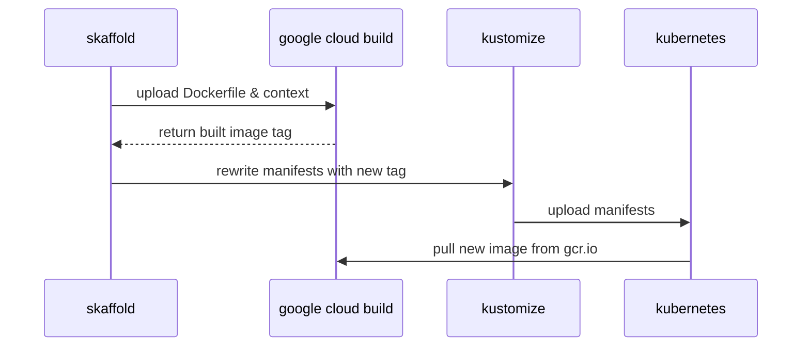

# TODOS

- Update documentation to point to github
- send to josh for review
- Publish docker image and edit location to latest
- TODO rewrite image name
- TODO rewrite repo links
- Need to scrub camunda-cloud-240911 from files
- Include whole manifest for those who don't want kustomise
- Note about prometheus configuration servicemonitors

 ## Authors

[Alastair Firth](https://github.com/afirth) is a Senior Site Reliability Engineer on the Camunda Cloud team.
[Lars Lange](https://github.com/Langleu) is a Devops Engineer at Camunda.

Are you running Kubernetes now? Ready to move your Camunda BPM instances off of VMs, or just try it out on Kubernetes? We will address some common configurations and provide some building blocks you can tailor to your particular needs. A working knowledge of Kubernetes is assumed.

## TL:DR;

```
git clone https://github.com/afirth/camunda-examples.git
cd camunda-examples/camunda-bpm-demo
make
```

If you get errors please install Kustomize from HEAD (see prereqs)

# What is Camunda BPM

[Camunda BPM](https://camunda.com) is an [open source](https://github.com/camunda/camunda-bpm-platform) platform for workflow and decision automation that brings business users and software developers together. It is ideal for coordinating and connecting humans, (micro)services, or even robots! You can read more about some use cases [here](https://camunda.com/solutions/).

# Why run on Kubernetes

Kubernetes has become the de facto standard for running modern applications on Linux. By using system calls instead of emulating the hardware layer, and allowing the kernel to manage memory and task switching, overhead and startup times are minimized. However, the greatest benefit may come in the standard API it provides for configuring the infrastructure all applications need, such as storage, networking, and monitoring. 5 years old in June 2019, it's arguably the second largest open source project ever (behind Linux), and is stabilizing in feature set after the rapid iteration of the past few years as it becomes critical to production workloads around the globe.

Camunda BPM Engine can easily connect easily to other applications running in the same cluster, and Kubernetes provides great scalability, allowing you to grow your infrastructure costs only when the software really needs it (and shrink it moments later).

Visibility is also greatly improved by tools like Prometheus, Grafana, Loki, Fluentd and Elasticsearch allowing a centralized view of all cluster workloads. We'll look at how to inject a Prometheus exporter into the JVM today.

# Goals

We'll address several areas where we can configure the Camunda BPM docker image ([github](https://github.com/camunda/docker-camunda-bpm-platform)) to play nicely with Kubernetes.

1. Logs and metrics
2. Database connections
3. Authentication
4. Session Management

We will go through some techniques to address these, and show a workflow that might work for you.

## Prerequisites

- A working [Kubernetes](https://kubernetes.io/) cluster
  - [GKE](https://cloud.google.com/free/) or minikube are a good way to get started
- [Optional] [Kustomize > 2.0.3](https://github.com/kubernetes-sigs/kustomize) for managing yaml overlays without forking the whole manifest, allowing you to `git pull --rebase` future improvements
  - Variable support in the ingress was added after 2.0.3 was released, so for now and make sure that [go installed binaries are available on your PATH](https://gist.github.com/afirth/fabc04406eb584601b473f599eb0170a) and `go get sigs.k8s.io/kustomize`
 - [Optional] [Skaffold](https://skaffold.dev/) for building your own docker images and deploying easily to GKE
   - download the latest release
     - `curl -Lo skaffold https://storage.googleapis.com/skaffold/releases/latest/skaffold-linux-amd64
&& chmod +x skaffold && sudo mv skaffold /usr/local/bin`
    - if you're using [google cloud build](https://console.cloud.google.com/cloud-build/), then
     - `gcloud auth application-default login`
  - otherwise configure `skaffold.yaml` for your providers

## Basic Workflow

## Logs and Metrics

Prometheus has become the standard for capturing metrics in Kubernetes. It fills the same niche as AWS Cloudwatch Metrics, Cloudwatch Alerts, Stackdriver Metrics, StatsD, Datadog, Nagios, vSphere Metrics and others. It's open source and has a powerful query language. The front end of choice is Grafana, and it comes with lots of dashboards available out of the box. They are bundled together and relatively easy to install with the [prometheus-operator helm chart](https://github.com/helm/charts/tree/master/stable/prometheus-operator).

Prometheus defaults to a pull model scraping `<service>/metrics`, and adding a sidecar container to expose this is common. Unfortunately the JMX metrics are best captured from inside the JVM, so a sidecar isn't as effective. Let's plug the [open source jmx_exporter](https://github.com/prometheus/jmx_exporter) from Prometheus into the JVM by adding it to the container image, which will expose a `/metrics` path on another port.

### Add the Prometheus jmx_exporter to the container
```
-- images/camunda-bpm/Dockerfile
FROM camunda/camunda-bpm-platform:tomcat-7.11.0

## Add prometheus exporter
RUN wget https://repo1.maven.org/maven2/io/prometheus/jmx/jmx_prometheus_javaagent/0.11.0/jmx_prometheus_javaagent-0.11.0.jar -P lib/
#9404 is the reserved prometheus-jmx port
ENV CATALINA_OPTS -javaagent:lib/jmx_prometheus_javaagent-0.11.0.jar=9404:/etc/config/prometheus-jmx.yaml
```
Well that was easy. The exporter will monitor tomcat and expose it's metrics in Prometheus format at `<svc>:9404/metrics`

#### Configure the exporter
The sharp-eyed reader may wonder where `prometheus-jmx.yaml` is coming from. There are many different things that can run in a JVM, and tomcat is just one of them, so the exporter needs some configuration. Standard configurations for tomcat, wildfly, kafka, etc are available [here](https://github.com/prometheus/jmx_exporter/tree/master/example_configs). We'll add the tomcat one as a [ConfigMap](https://kubernetes.io/docs/tasks/configure-pod-container/configure-pod-configmap/) in Kubernetes, and then mount it as a volume.

First, we add the tomcat-flavored exporter config file to our `platform/config/` directory:

```
platform/config
└── prometheus-jmx.yaml
```
Then we add a [ConfigMapGenerator]([https://github.com/kubernetes-sigs/kustomize/blob/master/examples/configGeneration.md](https://github.com/kubernetes-sigs/kustomize/blob/master/examples/configGeneration.md)) to `kustomization.yaml`:
```
-- platform/kustomization.yaml
apiVersion: kustomize.config.k8s.io/v1beta1
kind: Kustomization
[...]
configMapGenerator:
  - name: config
    files:
      - config/prometheus-jmx.yaml
```
This will add each element of `files[]` as an element of the `config` ConfigMap. ConfigMapGenerators are great because they hash the data in the config and trigger a pod restart if it changes. They also reduce the amount of configuration in the Deployment, as you can mount the whole "folder" of config files in one VolumeMount.

Finally we need to mount the ConfigMap as a volume to the pod:
```
-- platform/deployment.yaml
apiVersion: apps/v1
kind: Deployment
[...]
spec:
  template:
    spec:
    [...]
      volumes:
        - name: config
          configMap:
            name: config
            defaultMode: 0744
      containers:
        - name: camunda-bpm
          volumeMounts:
            - mountPath: /etc/config/
              name: config
    [...]
```
Nice. All files we add to the ConfigMapGenerator will be exposed in the new `/etc/config` directory.
 You can extend this pattern to mount any other configuration files you need. You can even mount a new startup script. You can use the [subpath](https://kubernetes.io/docs/concepts/storage/volumes/#using-subpath) oubject to mount a single fileIf you find yourself needing to update xml files in place, please consider using [xmlstarlet](http://xmlstar.sourceforge.net/docs.php) instead of sed. It's already included in the image.

### Logs
Great news! The application logs are already available on `stdout`, for example with `kubectl logs`. Fluentd (installed by default on GKE) will forward your logs to Elasticsearch, Loki, or your enterprise log platform. If you want to jsonify your logs, you could follow the pattern above to [set up logback.](https://forum.camunda.org/t/camunda-json-logging-for-shared-engine-solved/8651)

# How to run on Kubernetes - manifests (plain)

> **Note:** Kustomize variable handling is still relatively new. Although kustomize is now included in kubectl as `kubectl apply -k`, as of 1.14.2 you still need to `go get sigs.k8s.io/kustomize` for the `$HOSTNAME` to work. If that's not an option, you can hardcode the variable references in  `ingress-patch.yaml`

> **Note:** Secret value plugins are [available now in kustomize](https://github.com/kubernetes-sigs/kustomize/blob/master/examples/secretGeneratorPlugin.md#secret-values-from-anywhere). This allows you to populate them from sources such as existing kube-secrets or vault. Check it out!



```
.
├── Makefile
├── images
│   └── camunda-bpm
│       └── Dockerfile
├── ingress-patch.yaml
├── kustomization.yaml
├── namespace.yaml
├── platform
│   ├── config
│   │   └── prometheus-jmx.yaml
│   ├── deployment.yaml
│   ├── ingress.yaml
│   ├── kustomization.yaml
│   └── service.yaml
├── site-data.yaml
├── site-data.yaml.example
└── skaffold.yaml
```


## Questions?
Please ask questions specific to Camunda on our [forum](http://forum.camunda.org)!  Questions about Kubernetes may be better asked on the [k8s slack](https://slack.k8s.io/).
<!--stackedit_data:
eyJoaXN0b3J5IjpbNjMwMTc0NTk5XX0=
-->
